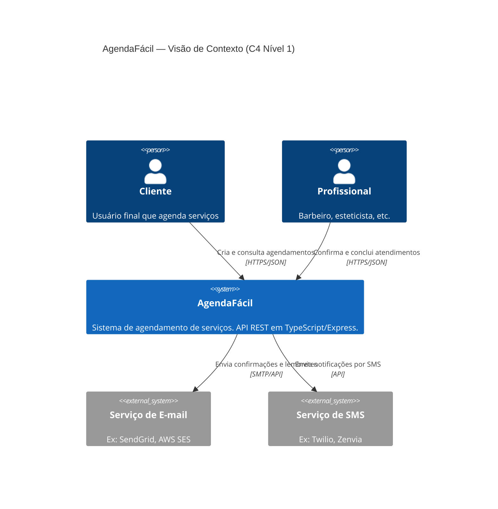
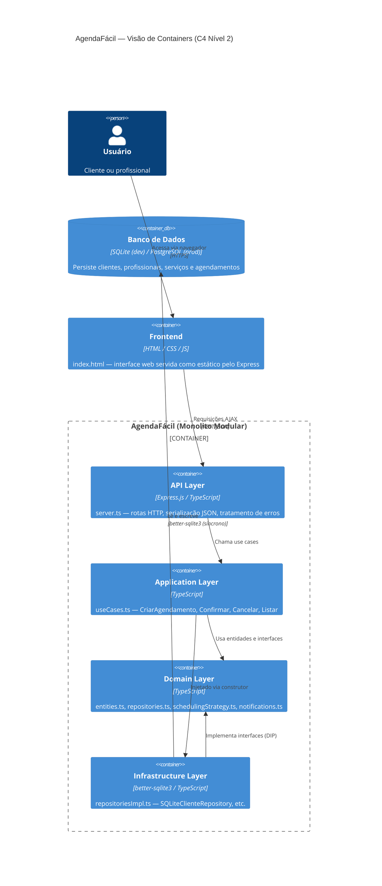

```mermaid
C4Context
    title AgendaFácil — Visão de Contexto (C4 Nível 1)

    Person(cliente, "Cliente", "Usuário final que agenda serviços")
    Person(profissional, "Profissional", "Barbeiro, esteticista, etc.")

    System(agendafacil, "AgendaFácil", "Sistema de agendamento de serviços. API REST em TypeScript/Express.")

    System_Ext(email, "Serviço de E-mail", "Ex: SendGrid, AWS SES")
    System_Ext(sms, "Serviço de SMS", "Ex: Twilio, Zenvia")

    Rel(cliente, agendafacil, "Cria e consulta agendamentos", "HTTPS/JSON")
    Rel(profissional, agendafacil, "Confirma e conclui atendimentos", "HTTPS/JSON")
    Rel(agendafacil, email, "Envia confirmações e lembretes", "SMTP/API")
    Rel(agendafacil, sms, "Envia notificações por SMS", "API")
```

```mermaid
C4Container
    title AgendaFácil — Visão de Containers (C4 Nível 2)

    Person(usuario, "Usuário", "Cliente ou profissional")

    Container_Boundary(app, "AgendaFácil (Monolito Modular)") {
        Container(api, "API Layer", "Express.js / TypeScript", "server.ts — rotas HTTP, serialização JSON, tratamento de erros")
        Container(application, "Application Layer", "TypeScript", "useCases.ts — CriarAgendamento, Confirmar, Cancelar, Listar")
        Container(domain, "Domain Layer", "TypeScript", "entities.ts, repositories.ts, schedulingStrategy.ts, notifications.ts")
        Container(infra, "Infrastructure Layer", "better-sqlite3 / TypeScript", "repositoriesImpl.ts — SQLiteClienteRepository, etc.")
    }

    ContainerDb(db, "Banco de Dados", "SQLite (dev) / PostgreSQL (prod)", "Persiste clientes, profissionais, serviços e agendamentos")
    Container(frontend, "Frontend", "HTML / CSS / JS", "index.html — interface web servida como estático pelo Express")

    Rel(usuario, frontend, "Acessa via navegador", "HTTPS")
    Rel(frontend, api, "Requisições AJAX", "REST/JSON")
    Rel(api, application, "Chama use cases")
    Rel(application, domain, "Usa entidades e interfaces")
    Rel(infra, domain, "Implementa interfaces (DIP)")
    Rel(application, infra, "Injetado via construtor")
    Rel(infra, db, "Lê e escreve", "better-sqlite3 (síncrono)")
```
