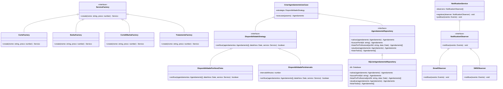

```mermaid
classDiagram
    %% ── FACTORY METHOD (factories.ts) ───────────────────────────────────────
    class ServicoFactory {
        <<interface>>
        +create(nome: string, preco: number) Servico
    }
    class CorteFactory {
        +create(nome: string, preco: number) Servico
    }
    class BarbaFactory {
        +create(nome: string, preco: number) Servico
    }
    class CorteEBarbaFactory {
        +create(nome: string, preco: number) Servico
    }
    class TratamentoFactory {
        +create(nome: string, preco: number) Servico
    }
    ServicoFactory <|-- CorteFactory
    ServicoFactory <|-- BarbaFactory
    ServicoFactory <|-- CorteEBarbaFactory
    ServicoFactory <|-- TratamentoFactory

    %% ── STRATEGY (schedulingStrategy.ts) ───────────────────────────────────
    class DisponibilidadeStrategy {
        <<interface>>
        +verificar(agendamentos: Agendamento[], dataHora: Date, servico: Servico) boolean
    }
    class DisponibilidadePorHoraCheia {
        +verificar(agendamentos: Agendamento[], dataHora: Date, servico: Servico) boolean
    }
    class DisponibilidadePorIntervalo {
        -intervaloMinutos: number
        +verificar(agendamentos: Agendamento[], dataHora: Date, servico: Servico) boolean
    }
    class CriarAgendamentoUseCase {
        -estrategia: DisponibilidadeStrategy
        +executar(params) Agendamento
    }
    DisponibilidadeStrategy <|-- DisponibilidadePorHoraCheia
    DisponibilidadeStrategy <|-- DisponibilidadePorIntervalo
    CriarAgendamentoUseCase o-- DisponibilidadeStrategy

    %% ── OBSERVER (notificationService.ts) ──────────────────────────────────
    class NotificationObserver {
        <<interface>>
        +notificar(evento: Evento) void
    }
    class EmailObserver {
        +notificar(evento: Evento) void
    }
    class SMSObserver {
        +notificar(evento: Evento) void
    }
    class NotificationService {
        -observers: NotificationObserver[]
        +registrar(observer: NotificationObserver) void
        +publicar(evento: Evento) void
    }
    NotificationObserver <|-- EmailObserver
    NotificationObserver <|-- SMSObserver
    NotificationService o-- NotificationObserver

    %% ── REPOSITORY — interfaces DIP (repositories.ts / repositoriesImpl.ts) ─
    class AgendamentoRepository {
        <<interface>>
        +salvar(agendamento: Agendamento) Agendamento
        +buscarPorId(id: string) Agendamento
        +listarPorProfissional(profId: string, data: Date) Agendamento[]
        +atualizar(agendamento: Agendamento) Agendamento
        +listarTodos() Agendamento[]
    }
    class SQLiteAgendamentoRepository {
        -db: Database
        +salvar(agendamento: Agendamento) Agendamento
        +buscarPorId(id: string) Agendamento
        +listarPorProfissional(profId: string, data: Date) Agendamento[]
        +atualizar(agendamento: Agendamento) Agendamento
        +listarTodos() Agendamento[]
    }
    AgendamentoRepository <|-- SQLiteAgendamentoRepository
    CriarAgendamentoUseCase o-- AgendamentoRepository
```
