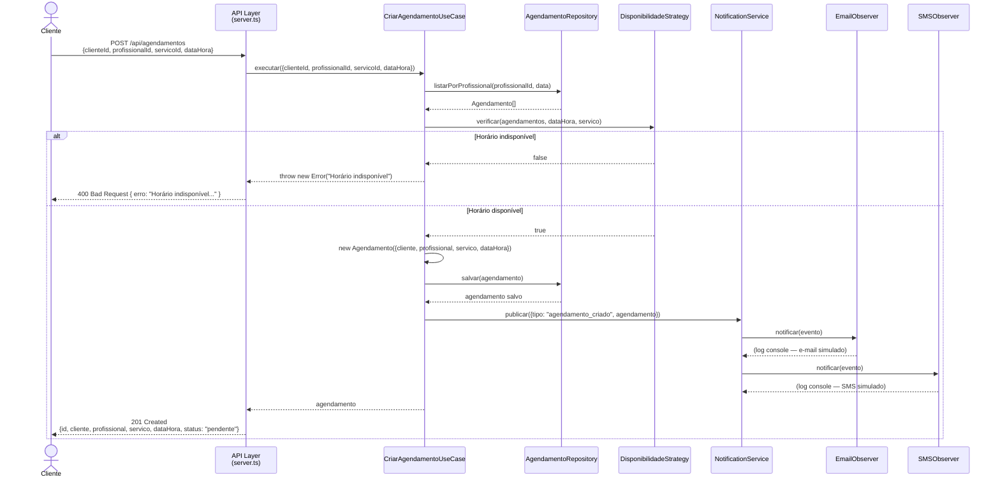

```mermaid
sequenceDiagram
    actor Cliente
    participant API as API Layer<br/>(server.ts)
    participant UC as CriarAgendamentoUseCase
    participant Repo as AgendamentoRepository
    participant Strategy as DisponibilidadeStrategy
    participant NS as NotificationService
    participant Email as EmailObserver
    participant SMS as SMSObserver

    Cliente->>API: POST /api/agendamentos<br/>{clienteId, profissionalId, servicoId, dataHora}
    API->>UC: executar({clienteId, profissionalId, servicoId, dataHora})

    UC->>Repo: listarPorProfissional(profissionalId, data)
    Repo-->>UC: Agendamento[]

    UC->>Strategy: verificar(agendamentos, dataHora, servico)
    alt Horário indisponível
        Strategy-->>UC: false
        UC-->>API: throw new Error("Horário indisponível")
        API-->>Cliente: 400 Bad Request { erro: "Horário indisponível..." }
    else Horário disponível
        Strategy-->>UC: true
        UC->>UC: new Agendamento({cliente, profissional, servico, dataHora})
        UC->>Repo: salvar(agendamento)
        Repo-->>UC: agendamento salvo

        UC->>NS: publicar({tipo: "agendamento_criado", agendamento})
        NS->>Email: notificar(evento)
        Email-->>NS: (log console — e-mail simulado)
        NS->>SMS: notificar(evento)
        SMS-->>NS: (log console — SMS simulado)

        UC-->>API: agendamento
        API-->>Cliente: 201 Created<br/>{id, cliente, profissional, servico, dataHora, status: "pendente"}
    end
```
